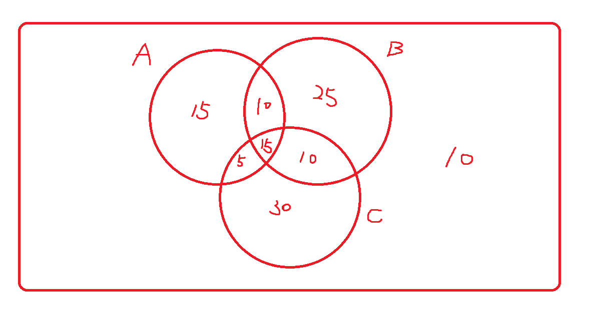

# 機率 hw1

## 資工二 111590012 林品緯

### 1.

$$
\begin{align*}
    \frac{6.8-5}{6.8-3}=\frac{1.8}{3.8}=0.474
\end{align*}
$$

Ans: 
機率為 0.474

### 2.

Ans: 
有 400 種結果。

第二個數字比第一個多 4 的組合有下列 16 種 : 
(1,5), (2,6), (3,7), (4,8), (5,9), (6,10), (7,11), (8,12), (9,13), (10,14), (11,15), (12,16), (13,17), (14,18), (15,19), (16,20) 

$$
\begin{align*}
    \frac{16}{400}=0.04
\end{align*}
$$

Ans: 
機率為 0.04

### 3.

A = 購買熱可可的顧客 
B = 不購買奶製品的顧客 

$$
\begin{align*}
    P(A) &= 0.4 \\
    P(B) &= 0.45 \\
    P(B^c) &= 0.55 \\
    P(A\cap B^c) &= 0.25 \\\\
    P(A\cup B^c) &= P(A)+P(B^c)-P(A\cap B^c) \\
                 &= 0.4+0.55-0.25 \\
                 &= 0.70
\end{align*}
$$

Ans: 
顧客購買熱可可或是奶製品是 70%。

### 4.

$$
\begin{align*}
    \sum^{\infty}_{i=1}\frac{1}{3^i} &= \frac{\frac{1}{3}}{1-\frac{1}{3}}\\
    &=\frac{1}{2}
\end{align*}
$$

Ans: 
不行，因為全部事件機率的總和不為 1。

### 5.

棍子 1 = x 
棍子 2 = 1-x

棍子 1 比較長 :

$$
\begin{align*}
    x &\ge 4(1-x) \\
    5x &\ge 4 \\
    x &\ge 0.8 \\
\end{align*}
$$

棍子 2 比較長 :

$$
\begin{align*}
    1-x &\ge 4x \\
    1 &\ge 5x \\
    0.2 &\ge x \\
\end{align*}
$$

$$
\begin{align*}
    P=\frac{(0.2)+(1-0.8)}{1}=0.4
\end{align*}
$$

Ans: 
機率為 0.4

### 6.

$$
\begin{align*}
    P(\{c\}) &= 1-P(\{a,b\})=0.4 \\
    P(\{b\}) &= 1-P(\{a,c\})=0.2 \\
    P(\{a\}) &= P(\{a,b\})-P(\{b\})=0.4 \\
\end{align*}
$$

### 7.

總共有 100\*100=10000 種結果。當第一個選到 n 時，第二個小於的總數為 n。

符合條件的情況 :

$$
\begin{align*}
    \sum^{100}_{i=1}{i} &= \frac{(100+1)\times 100}{2}\\
    &=5050
\end{align*}
$$

$$
\begin{align*}
    P=\frac{5050}{10000}=0.505
\end{align*}
$$

Ans: 
機率為 0.505

### 8.

(a) 

$$
\begin{align*}
    P(A)=\frac{15}{120}=0.125
\end{align*}
$$

Ans: 
機率為 0.125

(b) 

$$
\begin{align*}
    P(A)=\frac{25}{120}=0.208
\end{align*}
$$

Ans: 
機率為 0.208

(c) 

$$
\begin{align*}
    P(A)=\frac{25}{120}=0.208
\end{align*}
$$

Ans: 
機率為 0.208

### 9.

$$
\begin{align*}
    A\cup B &= A\cup(\bar{A}\cap B) \quad &\text{(互斥)}\\
    B &= (A\cap B)\cup(\bar{A}\cap B) \quad &\text{(互斥)}\\\\
\end{align*}
$$

$$
\begin{align*}
    P(A\cup B) &= P(A)+P(\bar{A}\cap B) \tag{1}\\
    P(B) &= P(A\cap B)+P(\bar{A} \cap B) \tag{2}\\
\end{align*}
$$

(2) 帶入 (1)

$$
\begin{align*}
    P(A\cup B) &= P(A)+P(B)-P(A\cap B)\\
\end{align*}
$$

### 10.

$$P(A\cup B) = P(A)+P(B)-P(A\cap B)$$
$$P(A\cap B) = P(A)+P(B)-P(A\cup B)$$
$$P(A\cup B) \le 1$$
$$-P(A\cup B) \ge -1$$
$$P(A)+P(B)-P(A\cup B) \ge P(A)+P(B)-1$$
$$P(A\cap B) \ge P(A)+P(B)-1$$
