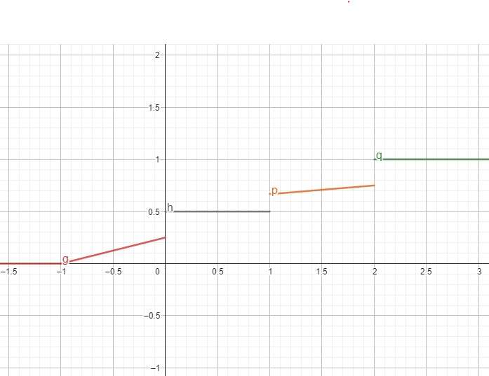
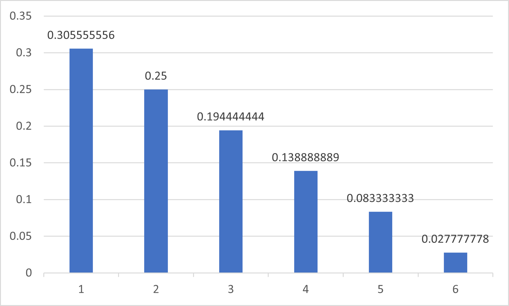
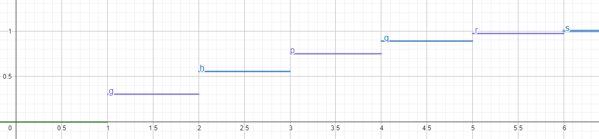

# 機率 hw5

## 資工二 111590012 林品緯

### 1.

Ans:

可能會出現的值:

0, 1, 2, 3, 4, 5

不同值的機率:

$$
\begin{aligned}
P(X=0)=&\frac{6}{36} \\
P(X=1)=&\frac{10}{36} \\
P(X=2)=&\frac{8}{36} \\
P(X=3)=&\frac{6}{36} \\
P(X=4)=&\frac{4}{36} \\
P(X=5)=&\frac{2}{36} \\
\end{aligned}
$$

### 2.

Ans:

$$
\begin{aligned}
P(X\lt 1)=&F(1^-) \\
=& \frac{1}{2}
\end{aligned}
$$

$$
\begin{aligned}
P(X=1) =&F(1)-F(1^-) \\
=&\frac{1}{12}+\frac{7}{12} - \frac{1}{2} \\
=&\frac{2}{12} \\
=&\frac{1}{6}
\end{aligned}
$$

$$
\begin{aligned}
P(0\leq X\lt 1) =&F(1^-)-F(0^-) \\
=&\frac{1}{2}-\frac{1}{4} \\
=&\frac{1}{4}
\end{aligned}
$$

$$
\begin{aligned}
P(X\gt\frac{1}{2})=&1-F(\frac{1}{2}) \\
=&1-\frac{1}{2} \\
=&\frac{1}{2}
\end{aligned}
$$

$$
\begin{aligned}
P(X=\frac{3}{2})=&F(\frac{3}{2})-F(\frac{3}{2}^-) \\
=&0
\end{aligned}
$$

$$
\begin{aligned}
P(1\lt X \leq 6)=&F(6)-F(1) \\
=&1-\frac{8}{12} \\
=&\frac{4}{12} \\
=&\frac{1}{3}
\end{aligned}
$$

### 3.

$$
\begin{aligned}
1-P(\text{連續 n 個沒出過國})\geq& 0.6 \\
1-\left(0.88\right)^n \geq& 0.6 \\
0.4 \geq& \left(0.88\right)^n \\
\log{0.4} \geq& n\times\log{0.88} \\
\frac{\log{0.4}}{\log{0.88}} \leq& n \\
n\geq& 7.167852346
\end{aligned}
$$

Ans:

8 個

### 4.

| X   | 元素                                                                                   | 數量 |
| --- | -------------------------------------------------------------------------------------- | ---- |
| 1   | (1, 1), (1, 2), (1, 3), (1, 4), (1, 5), (1, 6), (2, 1), (3, 1), (4, 1), (5, 1), (6, 1) | 11   |
| 2   | (2, 2), (2, 3), (2, 4), (2, 5), (2, 6), (3, 2), (4, 2), (5, 2), (6, 2)                 | 9    |
| 3   | (3, 3), (3, 4), (3, 5), (3, 6), (4, 3), (5, 3), (6, 3)                                 | 7    |
| 4   | (4, 4), (4, 5), (4, 6), (5, 4), (6, 4)                                                 | 5    |
| 5   | (5, 5), (5, 6), (6, 5)                                                                 | 5    |
| 6   | (6, 6)                                                                                 | 1    |

Ans:

probability mass function

distribution function

### 5.

$$
\begin{aligned}
E(X) =& 30\times\frac{4000}{2000000}+800\times\frac{500}{2000000}+1200000\times\frac{1}{2000000} \\
=& 0.86
\end{aligned}
$$

Ans:

每次獲得獎金期望值為 0.86

每次利潤期望值為 -0.14

### 6.

$$
\begin{aligned}
E(X)=&1\times\frac{1}{10}+2\times\frac{1}{10}+\cdots+10\times\frac{1}{10} \\
=&5.5
\end{aligned}
$$

$$
\begin{aligned}
E(X^2)=&1^2\times\frac{1}{10}+2^2\times\frac{1}{10}+\cdots+10^2\times\frac{1}{10} \\
=&38.5
\end{aligned}
$$

$$
\begin{aligned}
E(X(11-X))=&E(11X-X^2) \\
=&E(11X)-E(X^2) \\
=&11E(X)-E(X^2) \\
=&11\times 5.5+38.5\\
=&22
\end{aligned}
$$

Ans:

22

### 7.

Ans:

選擇第一家公司，因為第一家公司的標準差比第二家小，這說明第一家公司比較穩定。

### 8.

$$
\begin{aligned}
P(X=-3)=&\frac{3}{8} \\
P(X=0)=&\frac{3}{8} \\
P(X=6)=&\frac{1}{4}
\end{aligned}
$$

$$
\begin{aligned}
E(X)=&(-3)\times\frac{3}{8}+0\times\frac{3}{8}+6\times\frac{1}{4} \\
=&-\frac{9}{8}+\frac{12}{8} \\
=&\frac{3}{8}
\end{aligned}
$$

$$
\begin{aligned}
E(X^2)=&(-3)^2\times\frac{3}{8}+0^2\times\frac{3}{8}+6^2\times\frac{1}{4} \\
=&-\frac{27}{8}+\frac{72}{8} \\
=&\frac{99}{8}
\end{aligned}
$$

$$
\begin{aligned}
Var(X)=&E(X^2)-E(X)^2 \\
=&\frac{99}{8}-\left(\frac{3}{8}\right)^2 \\
=&\frac{99}{8}=\frac{9}{64} \\
=&\frac{783}{64}
\end{aligned}
$$

$$
\begin{aligned}
\sigma_{X}=&\frac{\sqrt{783}}{8}\\
=&\frac{3\sqrt{87}}{8}
\end{aligned}
$$

Ans:

$Var(X)=\frac{783}{64}$

$\sigma_{X}=\frac{3\sqrt{87}}{8}$

### 9.

$$
\begin{aligned}
E(X^2-2X)=&3 \\
E(X^2)-2E(X)=&3 \\
E(X^2)=&3+2E(X) \\
E(X^2)=&5
\end{aligned}
$$

$$
\begin{aligned}
Var(X)=&E(X^2)-E(X)^2 \\
=&5-1\\
=&4
\end{aligned}
$$

$$
\begin{aligned}
Var(-3X+7)=&(-3)^2\times Var(X) \\
=&9\times 4\\
=36
\end{aligned}
$$

Ans:

36
