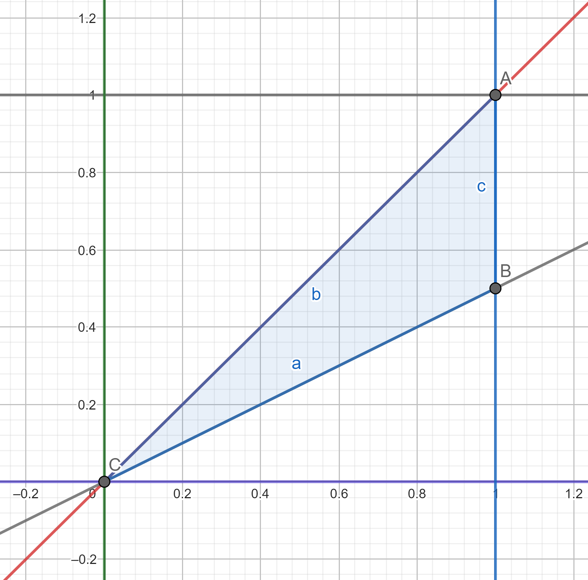

# 機率 hw9

## 資工二 111590012 林品緯

### 1.

#### (a)

$$
\begin{aligned}
p(1,1) =& 2k \\
p(1,3) =& 10k \\
p(2,3) =& 13k
\end{aligned}
$$

$$
\begin{aligned}
p(1,1)+p(1,3)+p(2,3) =& 1 \\
2k+10k+13k =& 1 \\
25k =& 1 \\
k =& \frac{1}{25} \\
k =& 0.04
\end{aligned}
$$

Ans:

$k=0.04$

#### (b)

$$
\begin{aligned}
p_x(x) =& \frac{1}{25}[(1^2+1^2)+(1^2+3^2)] \\
=& \frac{12}{25} \quad x=1
\end{aligned}
$$

$$
\begin{aligned}
p_x(x) =& \frac{1}{25}[(2^2+3^2)] \\
=&\frac{13}{25} \quad x=2
\end{aligned}
$$

$$
\begin{aligned}
p_y(y) =& \frac{1}{25}[(1^2+1^2)] \\
=&\frac{2}{25} \quad y=1
\end{aligned}
$$

$$
\begin{aligned}
p_y(y) =& \frac{1}{25}[(1^2+3^2)+(2^2+3^3)] \\
=&\frac{23}{25} \quad y=3
\end{aligned}
$$

Ans:

$$
p_x(x)=
\begin{cases}
\frac{12}{25} & x=1 \\
\frac{13}{25} & x=2 \\
0 & \text{otherwise}
\end{cases}
$$

$$
p_y(y)=
\begin{cases}
\frac{2}{25} & x=1 \\
\frac{23}{25} & x=3 \\
0 & \text{otherwise}
\end{cases}
$$

#### \(c\)

$$
\begin{aligned}
E(X) =& 1\times\frac{12}{25}+2\times\frac{13}{25} \\
=& \frac{38}{25}
\end{aligned}
$$

$$
\begin{aligned}
E(Y) =& 1\times\frac{2}{25}+3\times\frac{23}{25} \\
=& \frac{71}{25}
\end{aligned}
$$

Ans:

$E(X)=\frac{38}{25}$

$E(Y)=\frac{71}{25}$

### 2.

sum / absolute value of ther difference

|     | 1   | 2   | 3   | 4    | 5    | 6    |
| --- | --- | --- | --- | ---- | ---- | ---- |
| 1   | 2/0 | 3/1 | 4/2 | 5/3  | 6/4  | 7/5  |
| 2   | 3/1 | 4/0 | 5/1 | 6/2  | 7/3  | 8/4  |
| 3   | 4/2 | 5/1 | 6/0 | 7/1  | 8/2  | 9/3  |
| 4   | 5/3 | 6/2 | 7/1 | 8/0  | 9/1  | 10/2 |
| 5   | 6/4 | 7/3 | 8/2 | 9/1  | 10/0 | 11/1 |
| 6   | 7/5 | 8/4 | 9/3 | 10/2 | 11/1 | 12/0 |

Ans:

| x\y      | 0              | 1               | 2              | 3              | 4              | 5              | $p_x(x)$       |
| -------- | -------------- | --------------- | -------------- | -------------- | -------------- | -------------- | -------------- |
| 2        | $\frac{1}{36}$ | 0               | 0              | 0              | 0              | 0              | $\frac{1}{36}$ |
| 3        | 0              | $\frac{2}{36}$  | 0              | 0              | 0              | 0              | $\frac{2}{36}$ |
| 4        | $\frac{1}{36}$ | 0               | $\frac{2}{36}$ | 0              | 0              | 0              | $\frac{3}{36}$ |
| 5        | 0              | $\frac{2}{36}$  | 0              | $\frac{2}{36}$ | 0              | 0              | $\frac{4}{36}$ |
| 6        | $\frac{1}{36}$ | 0               | $\frac{2}{36}$ | 0              | $\frac{2}{36}$ | 0              | $\frac{5}{36}$ |
| 7        | 0              | $\frac{2}{36}$  | 0              | $\frac{2}{36}$ | 0              | $\frac{2}{36}$ | $\frac{6}{36}$ |
| 8        | $\frac{1}{36}$ | 0               | $\frac{2}{36}$ | 0              | $\frac{2}{36}$ | 0              | $\frac{5}{36}$ |
| 9        | 0              | $\frac{2}{36}$  | 0              | $\frac{2}{36}$ | 0              | 0              | $\frac{4}{36}$ |
| 10       | $\frac{1}{36}$ | 0               | $\frac{2}{36}$ | 0              | 0              | 0              | $\frac{3}{36}$ |
| 11       | 0              | $\frac{2}{36}$  | 0              | 0              | 0              | 0              | $\frac{2}{36}$ |
| 12       | $\frac{1}{36}$ | 0               | 0              | 0              | 0              | 0              | $\frac{1}{36}$ |
| $p_y(y)$ | $\frac{6}{36}$ | $\frac{10}{36}$ | $\frac{8}{36}$ | $\frac{6}{36}$ | $\frac{4}{36}$ | $\frac{2}{36}$ |                |

### 3.

#### (a)

$$
\begin{aligned}
f_x(x) =& \int_{0}^{x}2dy \\
=& \left[2y\right]_{0}^{x} \\
=& 2x \quad 0\leq x \leq 1
\end{aligned}
$$

$$
\begin{aligned}
f_y(y) =& \int_{y}^{1}2dx \\
=& \left[2x\right]_{y}^{1} \\
=& 2-2y \quad 0\leq y \leq 1
\end{aligned}
$$

Ans:

$f_x(x)=2x \quad 0\leq x \leq 1$

$f_y(y)=2-2y \quad 0\leq y \leq 1$

#### (b)

$$
\begin{aligned}
E(X) =& \int_{-\infty}^{\infty}xf_x(x)dx \\
=& \int_{0}^{1}2x^2dx \\
=& \left[\frac{2}{3}x^3\right]_{0}^{1} \\
=&\frac{2}{3}
\end{aligned}
$$

$$
\begin{aligned}
E(Y) =& \int_{-\infty}^{\infty}yf_y(y)dy \\
=& \int_{0}^{1}2y-2y^2dy \\
=&\left[y^2-\frac{2}{3}y^3\right]_{0}^{1}dy\\
=&\frac{1}{3}
\end{aligned}
$$

Ans:

$E(X)=\frac{2}{3}$

$E(Y)=\frac{1}{3}$

#### \(c\)

$$
\begin{aligned}
P(X\lt \frac{1}{2}) =& \int_{0}^{\frac{1}{2}} 2xdx \\
=& \left[x^2\right]_{0}^{\frac{1}{2}} \\
=& \frac{1}{4}
\end{aligned}
$$

$$
\begin{aligned}
P(X\lt 2Y) =& \int_{0}^{1}\int_{\frac{x}{2}}^{x}2dydx \\
=& \int_{0}^{1}\left[2y\right]_{\frac{x}{2}}^{x}dx \\
=& \int_{0}^{1}(2x-x)dx \\
=&\left[\frac{1}{2}x^2\right]_{0}^{1} \\
=&\frac{1}{2}
\end{aligned}
$$

$$
\begin{aligned}
P(X=Y)=&\int_{y}^{y}\int_{x}^{x}2dydx \\
=& 0
\end{aligned}
$$

Ans:

$P(X\lt \frac{1}{2})=\frac{1}{4}$

$P(X\lt 2Y)=\frac{1}{2}$

$P(X=Y)=0$

#### (d)

$$
\begin{aligned}
f_x(x)=& 2x \\
f_y(y)=& 2-2y \\
f(x,y) =& 2 \\
f_x(x)f_y(y) \neq &f(x,y)
\end{aligned}
$$

Ans:

X and Y are not independent.

#### (e)

$$
\begin{aligned}
f_{x|y}(x|y) =& \frac{f(x,y)}{f_y(y)} \\
=& \frac{2}{2-2y} \\
=& \frac{1}{1-y} \quad 0\leq y\leq x\leq 1
\end{aligned}
$$

Ans:

$f_{x|y}(x|y)=\frac{1}{1-y} \quad 0\leq y\leq x\leq 1$

### 4.

$$
\begin{aligned}
p(1,1) =& \frac{1}{7}(1^21)  \\
=& \frac{1}{7}
\end{aligned}
$$

$$
\begin{aligned}
p_x(1) =& \frac{1}{7}[(1^21)+(1^22)] \\
=& \frac{3}{7}
\end{aligned}
$$

$$
\begin{aligned}
p_y(1) =& \frac{1}{7}[(1^21)+(2^21)] \\
=& \frac{5}{7}
\end{aligned}
$$

$$
\begin{aligned}
\frac{1}{7} \neq& \frac{3}{7}\times\frac{5}{7} \\
p(1,1) \neq& p_x(1)p_y(1)
\end{aligned}
$$

Ans:

X and Y are not independent.

### 5.

$$
\begin{aligned}
f_x(x) =& \int_{0}^{\infty}2e^{-(x+2y)}dy \\
=&\left[-e^{-(x+2y)}\right]_{0}^{\infty} \\
=&0-(-e^{-x}) \\
=&e^{-x}
\end{aligned}
$$

$$
\begin{aligned}
f_y(y) =& \int_{0}^{\infty}2e^{-(x+2y)}dx \\
=&\left[-2e^{-(x+2y)}\right]_{0}^{\infty} \\
=&0-(-2e^{-2y}) \\
=&2e^{-2y}
\end{aligned}
$$

$$
\begin{aligned}
2e^{-(x+2y)}=&e^{-x}\times 2e^{-2y} \\
f(x,y)=&f_x(x)f_y(y)
\end{aligned}
$$

X and Y are independent.

$$
\begin{aligned}
E(X^2)=&\int_{0}^{\infty}x^2e^{-x}dx \\
=&\left[-x^2e^{-x}\right]_{0}^{\infty}-\int_{0}^{\infty}-2xe^{-x}dx \\
=&(0-0)-([2xe^{-x}]_{0}^{\infty}-\int_{0}^{\infty}2e^{-x}dx) \\
=&\left[-2e^{-x}\right]_{0}^{\infty} \\
=&[0-(-2)] \\
=&2
\end{aligned}
$$

$$
\begin{aligned}
E(Y)=&\int_{0}^{\infty}y2e^{-2y}dy \\
=&\left[-ye^{-2y}\right]_{0}^{\infty}-\int_{0}^{\infty}-e^{-2y}dy \\
=&(0-0)-\left[\frac{1}{2}e^{-2y}\right]_{0}^{\infty} \\
=&-[0-\frac{1}{2}] \\
=&\frac{1}{2}
\end{aligned}
$$

$$
\begin{aligned}
E(X^2Y)=&E(X^2)E(Y) \\
=&2\times\frac{1}{2} \\
=&1
\end{aligned}
$$

Ans:

$E(X^2Y)=1$

### 6.

$$
\begin{aligned}
p_y(y)=&\frac{1}{25}[(1^2+y^2)+(2^2+y^2)] \\
=&\frac{5+2y^2}{25}
\end{aligned}
$$

$$
\begin{aligned}
p_{X|Y}(x|y)=&\frac{p(x,y)}{p_y(y)} \\
=&\frac{x^2+y^2}{25}\times\frac{25}{5+2y^2} \\
=&\frac{x^2+y^2}{5+2y^2} \quad x=1,2 \quad y=0,1,2
\end{aligned}
$$

$$
\begin{aligned}
P(X=2|Y=1) =& \frac{5}{7}
\end{aligned}
$$

$$
\begin{aligned}
E(X|Y=1)=&1\times P(x=1|y=1)+2\times P(x=2|y=1) \\
=&\frac{2}{7}+\frac{10}{7} \\
=&\frac{12}{7}
\end{aligned}
$$

Ans:

$p_{X|Y}(x|y)=\frac{x^2+y^2}{5+2y^2} \quad x=1,2 \quad y=0,1,2$

$P(X=2|Y=1)=\frac{5}{7}$

$E(X|Y=1)=\frac{12}{7}$

### 7.

#### (a)

Ans:

$$
f(x,y)=
\begin{cases}
2 & 0\leq x+y \leq 1,x\geq 0,y\geq0 \\
0 & \text{otherwise}
\end{cases}
$$

#### (b)

$$
\begin{aligned}
f_y(y) =& \int_{0}^{1-y} 2dx \\
=& \left[2x\right]_{0}^{1-y} \\
=&2-2y \quad 0\leq y\leq1
\end{aligned}
$$

$$
\begin{aligned}
f_{X|Y}(x|y) =& \frac{f(x,y)}{f_(y)} \\
=&\frac{2}{2-2y} \\
=&\frac{1}{1-y} \quad 0\leq y\leq 1,0\leq x\leq 1-y
\end{aligned}
$$

Ans:

$f_{X|Y}(x|y)=\frac{1}{1-y} \quad 0\leq y\leq 1,0\leq x\leq 1-y$

#### \(c\)

$$
\begin{aligned}
E(X|Y=y)=&\int_{0}^{1-y}x\frac{1}{1-y}dx \\
=&\left[\frac{1}{2(1-y)}x^2\right]_{0}^{1-y} \\
=&\frac{1-y}{2}
\end{aligned}
$$

Ans:

$E(X|Y=y)=\frac{1-y}{2}$

### 8.

#### (a)

$$
f(x)=
\begin{cases}
\frac{1}{2} & -1\leq x \leq 1 \\
0 & \text{otherwise}
\end{cases}
$$

$$
\begin{aligned}
F(x)=&\int_{-1}^{x}\frac{1}{2} \\
=&\left[\frac{x}{2}\right]_{-1}^{x} \\
=&\frac{x+1}{2}
\end{aligned}
$$

$$
F(x)=
\begin{cases}
0 & x\lt-1 \\
\frac{x+1}{2} & -1\leq x \lt 1 \\
1 & x\geq 1
\end{cases}
$$

$$
f(y)=
\begin{cases}
\frac{1}{2} & -1\leq y \leq 1 \\
0 & \text{otherwise}
\end{cases}
$$

$$
F(y)=
\begin{cases}
0 & y\lt-1 \\
\frac{y+1}{2} & -1\leq y \lt 1 \\
1 & y\geq 1
\end{cases}
$$

$$
\begin{aligned}
F_z(t)=&P(Z\leq t) \\
=&P(X\leq t, Y\leq t) \\
=&P(X\leq t)P(Y\leq t) \\
=&F_X(t)F_Y(t) \\
=&\left(\frac{t+1}{2}\right)^2 \quad -1 \leq t \leq 1
\end{aligned}
$$

Ans:

$$
F_z(t)=
\begin{cases}
0 & t\leq -1 \\
\left(\frac{t+1}{2}\right)^2&-1 \leq t \lt 1 \\
1 & t\geq 1
\end{cases}
$$

#### (b)

$$
\begin{aligned}
f_z(t) =& \frac{d}{dt}\frac{(t+1)^2}{4} \\
=&\frac{t+1}{2}
\end{aligned}
$$

$$
\begin{aligned}
E(Z)=&\int_{-1}^{1}z\frac{z+1}{2}dz \\
=&\int_{-1}^{1}\frac{z^2+z}{2}dz \\
=&\left[\frac{z^3}{6}+\frac{z^2}{4}\right]_{-1}^{1} \\
=&(\frac{1}{6}+\frac{1}{4})-(\frac{-1}{6}+\frac{1}{4}) \\
=&\frac{1}{3}
\end{aligned}
$$

Ans:

$E(Z)=\frac{1}{3}$
